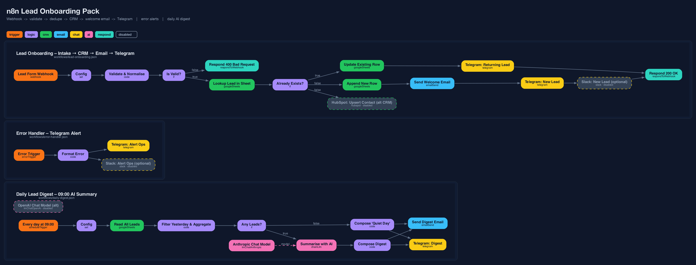

# n8n Lead Onboarding Pack

**Website form → validated lead → Google Sheets CRM → welcome email → Telegram alert**, plus an error-alert workflow and a 09:00 AI-written daily digest. Three importable n8n workflows, a self-hosting stack, structural tests and a written handover.



> Delivered as **JSON export + written handover** — a client imports the files, follows `docs/SETUP.md`, and owns a working system. No call required.

---

## The problem

A small sales team gets leads from a website form. Today the submission lands in a shared inbox: some are answered in minutes, some after three days, some twice, and nobody knows on Friday how many came in this week. Every CRM/SaaS bundle that solves this costs per seat and still needs someone to wire it up.

## The solution

An automation running on your own n8n (or n8n Cloud) that, within seconds of a submission:

1. **Validates and normalises** the data (trims, lower-cases the email, title-cases the name, rejects junk with a `400`).
2. **Scores** the lead 0–100 from simple signals (business email domain, company given, message length, buying-intent words).
3. **Deduplicates** against the CRM sheet by email: new contact → new row; returning contact → row updated, `submissions` counter bumped, no duplicate welcome email.
4. **Sends a welcome email** from your domain via any SMTP provider.
5. **Posts to the sales Telegram channel** with the score, contact and message (Slack optional).
6. **Answers the form** with `200 {"ok":true}` or a `400` explaining what was wrong.

Every failure anywhere is caught by a separate **Error Handler** workflow that posts the failing node, the error and a deep link to the run. And every morning a **Daily Digest** reads yesterday's rows, asks an LLM for a short "call these three first" briefing, and emails it with a table of all leads.

## What's in the box

```
n8n-lead-onboarding/
├── workflows/
│   ├── lead-onboarding.json     # workflow 1 – intake → CRM → email → Telegram (17 nodes)
│   ├── error-handler.json       # workflow 2 – Error Trigger → Telegram/Slack alert
│   └── daily-digest.json        # workflow 3 – cron 09:00 → sheet → LLM → email + Telegram
├── docker-compose.yml           # self-hosted n8n + Postgres
├── .env.example
├── docs/
│   ├── SETUP.md                 # step-by-step import + credentials
│   ├── HANDOVER.md              # what the client needs to run it without you
│   └── workflow.png             # diagram, generated from the JSON
├── scripts/render_diagram.py    # regenerates the diagram (graphviz, matplotlib fallback)
├── tests/
│   ├── validate_workflows.py    # structural validator (CLI + importable)
│   └── test_workflows.py        # pytest suite
└── Makefile                     # make validate | test | diagram | up | down | import
```

## Node-by-node

### Workflow 1 — `lead-onboarding.json`

| # | Node | Type | What it does |
|---|------|------|--------------|
| 1 | **Lead Form Webhook** | Webhook (POST `/webhook/lead-intake`) | Receives JSON or form-encoded `name, email, company, message[, source]`. Responds via a Respond node so the form gets a meaningful status code. |
| 2 | **Config** | Set | One place for the sheet ID, tab name, Telegram chat ID, sender address, company name, Slack channel. Every downstream node reads `$('Config')`. |
| 3 | **Validate & Normalise** | Code | Cleans fields, checks email syntax, computes `score`, `is_business_email`, timestamps; emits `valid` + `errors`. |
| 4 | **Is Valid?** | IF | `valid == true` → continue; else → node 5. |
| 5 | **Respond 400 Bad Request** | Respond to Webhook | Returns `{ok:false, errors:[…]}` with HTTP 400. Nothing is written. |
| 6 | **Lookup Lead in Sheet** | Google Sheets · read (filter `email`) | Dedupe check. *Always output data* is on so an empty result still flows. |
| 7 | **Already Exists?** | IF | Row found → node 8; not found → nodes 10 and 11. |
| 8 | **Update Existing Row** | Google Sheets · append-or-update (match `email`) | Sets `status=returning`, `submissions+1`, `last_seen_at`, `last_message`. |
| 9 | **Telegram: Returning Lead** | Telegram | "🔁 Returning lead" alert. |
| 10 | **Append New Row** | Google Sheets · append | Writes the full lead record (13 columns). |
| 11 | **HubSpot: Upsert Contact (alt CRM)** | HubSpot · contact upsert — *disabled* | Drop-in replacement for the sheet. Enable, add token, disable the sheet nodes. |
| 12 | **Send Welcome Email** | Send Email (SMTP) | Personalised HTML email quoting the lead's message; reply-to set to sales. |
| 13 | **Telegram: New Lead** | Telegram | "🆕 New lead — score 80/100 🔥" alert. |
| 14 | **Slack: New Lead (optional)** | Slack — *disabled* | Same alert for Slack teams. Disabled nodes pass data through. |
| 15 | **Respond 200 OK** | Respond to Webhook | `{ok:true, status:"created"|"updated", email}`. |
| — | Sticky notes | | On-canvas instructions for whoever opens the workflow. |

Settings: *Error workflow* → Error Handler; timezone set explicitly; execution order v1.

### Workflow 2 — `error-handler.json`

| Node | What it does |
|------|--------------|
| **Error Trigger** | n8n calls this workflow whenever a workflow that lists it as *Error workflow* fails. |
| **Format Error** (Code) | Normalises both payload shapes n8n produces (execution error vs trigger error), HTML-escapes, trims the stack, builds a Telegram-safe message. |
| **Telegram: Alert Ops** | Posts workflow name, node, error, mode, timestamp and an *Open execution* link. |
| **Slack: Alert Ops (optional)** — *disabled* | Same for Slack. |

### Workflow 3 — `daily-digest.json`

| Node | What it does |
|------|--------------|
| **Every day at 09:00** (Schedule, cron `0 9 * * *`) | Runs in the workflow timezone. |
| **Config** (Set) | Sheet ID, digest recipient, sender, Telegram chat ID. |
| **Read All Leads** (Google Sheets) | Reads the `Leads` tab. |
| **Filter Yesterday & Aggregate** (Code) | Keeps rows whose `created_date` is yesterday, sorts by score, computes count / hot / average, builds a plain-text list for the prompt and an HTML table for the email. Collapses to one item. |
| **Any Leads?** (IF) | `count > 0` → AI path; else → quiet-day path. |
| **Summarise with AI** (Basic LLM Chain) | Provider-agnostic prompt: overview, top-3 to follow up and why, patterns; ≤180 words; forbidden to invent details. |
| **Anthropic Chat Model** (sub-node) | Model placeholder — pick in the UI after adding a credential. |
| **OpenAI Chat Model (alt)** (sub-node, *disabled*, unconnected) | Swap in by dragging its connector onto the chain. |
| **Compose Digest** / **Compose 'Quiet Day'** (Code) | Build subject, HTML body and a short Telegram text. |
| **Send Digest Email** (SMTP) · **Telegram: Digest** | Deliver. The quiet-day heartbeat proves the automation is alive even with zero leads. |

## Deploy

```bash
git clone <this repo> && cd n8n-lead-onboarding
cp .env.example .env            # set POSTGRES_PASSWORD, N8N_ENCRYPTION_KEY, WEBHOOK_URL
make up                         # docker compose up -d  → http://localhost:5678
make import                     # CLI import, keeps workflow IDs
```

Then follow **[docs/SETUP.md](docs/SETUP.md)** for the Google Sheet headers, SMTP, Telegram bot, AI key and a curl test. Already on n8n Cloud? Skip Docker and import the three JSON files through *Workflows → Import from File*.

Verify locally without any credentials:

```bash
make validate    # structural checks: connections, orphans, expression refs, no secrets
make test        # pytest
make diagram     # regenerate docs/workflow.png from the JSON
```

## Adapting

**Another CRM.** The CRM is three Google Sheets nodes behind two IF branches. Replace them with:

| CRM | Node(s) | Dedupe |
|-----|---------|--------|
| HubSpot | the included disabled **HubSpot: Upsert Contact** node (upsert by email — no lookup needed, delete nodes 6–8) | native |
| Pipedrive | *Person → search* then *create/update* | same shape as the sheet lookup |
| Airtable / Notion / Baserow | *search records* → IF → *create* / *update* | same shape |
| Postgres / MySQL | one *Execute Query* with `INSERT … ON CONFLICT (email) DO UPDATE … RETURNING (xmax = 0) AS inserted` | native |

Keep the **Validate & Normalise** output contract (`lead.*` fields) and nothing else changes.

**Another form.** Anything that can POST works: plain HTML `<form action=…>`, Webflow/Framer/Typeform/Tally webhooks, a Next.js API route. Field aliases already accepted: `full_name`/`fullName`, `organisation`/`organization`, `comments`, `utm_source`. Add more in the first lines of the Code node. For n8n-hosted forms swap the Webhook node for a **Form Trigger** — the rest is unchanged.

**Another channel.** Telegram nodes are one-liners; Slack is already there disabled; Discord, Teams, WhatsApp (via Twilio) are equivalent single nodes fed by the same expressions.

**Another AI provider.** The digest uses a Basic LLM Chain with a swappable model sub-node — Anthropic ships connected, OpenAI is included disabled; Ollama/Groq/Gemini drop in the same way with no prompt changes.

**Security hardening for production.** Header-auth on the webhook, `allowedOrigins` restricted to your domain, `N8N_SECURE_COOKIE=true` behind HTTPS, prune executions (already configured to 14 days in `docker-compose.yml`).

## Validation

* `tests/validate_workflows.py` — checks every connection target exists, no orphan nodes, `$('Node')` expression references resolve, credential blocks carry only `id`/`name`, no API-key-shaped strings.
* Import-tested on **n8n 2.39.5** (Docker): all three files import via CLI and REST, all 35 node type/version pairs exist in that release's node registry, workflows activate, the webhook's invalid-input path returns the expected `400`, and a valid payload runs through Config → Validate → IF and stops precisely at the first placeholder credential (as it should without real accounts).

## Delivery format

* Three JSON exports with stable IDs (`lead-onboarding-main`, `lead-onboarding-error-handler`, `lead-onboarding-daily-digest`) — the error-workflow link survives a CLI import.
* Credential placeholders only (`REPLACE_ME`); no secrets anywhere in the repo, enforced by the tests.
* `docs/HANDOVER.md` — written for the person who owns it afterwards: where things live, what to change and where, what alerts mean, what needs a human occasionally.

## License

MIT — see [LICENSE](LICENSE).
